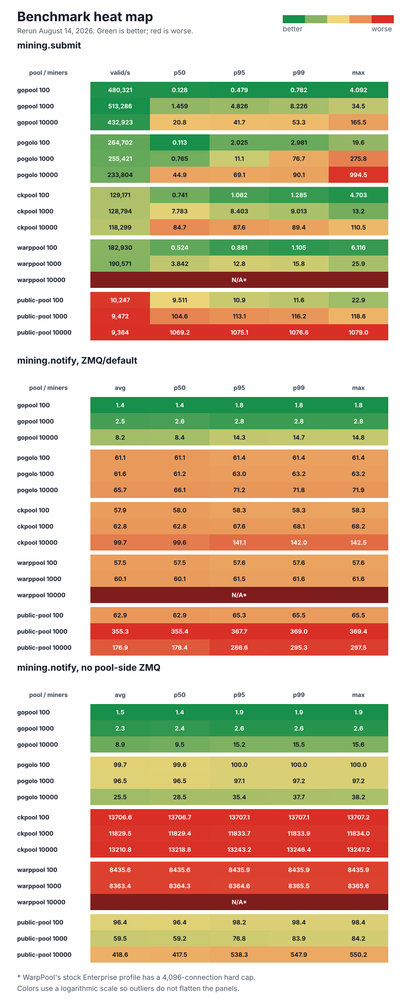

# Go benchmarks

Benchmarks for `mining.submit` and `mining.notify`. Use
`scripts/go-benchmark-env.sh` to start the local regtest pool environment.

## Current results

Unpinned results from a 32-logical-CPU host.



Every numeric value is a colored tile. Each metric column is scaled
independently; green is better and red is worse.

### mining.submit

Post-handshake submit validation with one in-flight submit per miner.

```text
  pool  miners  validated/s  p50_ms  p95_ms  p99_ms  max_ms
gopool     100       522540   0.117   0.429   0.727   9.172
gopool    1000       575001   1.197   4.683   8.001  47.206
gopool   10000       466238  19.045  41.480  45.521 152.737
pogolo     100       271670   0.112   1.961   2.891  16.451
pogolo    1000       265838   0.700  10.122  79.170 350.048
pogolo   10000       239552  42.009  68.344 108.005 973.041
ckpool     100       120562   0.797   1.186   1.481   4.407
ckpool    1000       114300   8.656  10.138  11.043  18.080
ckpool   10000       103228  97.312 101.608 111.109 127.904
```

### mining.notify, ZMQ/default

New-block to fresh-work fanout over `mining.notify`.

```text
  pool  miners  avg_ms  p50_ms  p95_ms  p99_ms  max_ms
gopool     100     2.3     2.3     2.7     2.7     2.8
gopool    1000     3.0     3.1     3.6     3.6     3.7
gopool   10000    10.3    11.1    15.8    16.1    16.2
pogolo     100    61.3    61.3    61.7    61.7    61.7
pogolo    1000    62.9    62.9    63.2    63.3    63.3
pogolo   10000    71.8    67.8    80.9    81.4    81.5
ckpool     100    57.1    57.1    57.7    57.7    57.7
ckpool    1000    64.2    64.2    69.4    69.7    69.8
ckpool   10000   115.3   114.6   166.2   170.1   171.2
```

### mining.notify, no pool-side ZMQ

```text
  pool  miners   avg_ms   p50_ms   p95_ms   p99_ms   max_ms
gopool     100      2.4      2.4      2.7      2.7      2.8
gopool    1000      3.0      3.0      3.5      3.6      3.6
gopool   10000      8.9      8.7     14.7     14.9     15.0
pogolo     100     99.2     99.0     99.8     99.9     99.9
pogolo    1000     93.1     93.1     93.9     93.9     93.9
pogolo   10000     69.2     69.2     75.6     76.2     76.4
ckpool     100  13968.0  13968.0  13968.5  13968.6  13968.6
ckpool    1000  14075.6  14075.7  14080.8  14081.2  14081.2
ckpool   10000  13600.0  13597.9  13656.4  13660.6  13661.8
```

ckpool uses `--worker-suffix=false --ordered-handshake`. The environment splits
bitcoind `hashblock` and `rawblock` ZMQ endpoints.

## Build

```bash
go build -o /tmp/go-submit-bench ./benchmarks/go/submit
go build -o /tmp/go-notify-fanout ./benchmarks/go/notify-fanout
```

## Environment

```bash
./scripts/go-benchmark-env.sh --help
```
